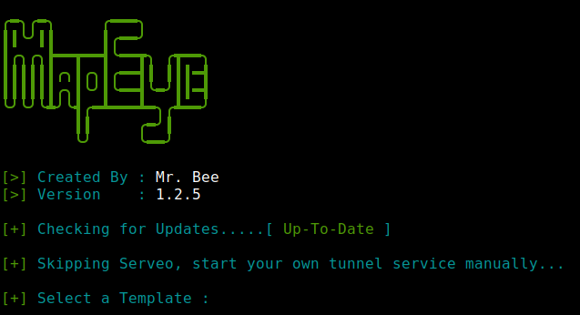

<p align=center>
  </p>

  <br>

<p align=center>
  <a href="https://www.instagram.com/bhikan_deshmukh"></a>
  </p>

###### <p align="center"> *MapEye*

  <br>

<p align="center"></p>

###### <p align="center">Accurate GPS Location Tracker (Android, IOS, Windows phones.)
<p align=center>
  <a href="https://www.instagram.com/bhikan_deshmukh"></a>
  <a href="https://www.instagram.com/bhikan_deshmukh"></a>
  <a href="https://www.instagram.com/bhikan_deshmukh"></a>
  <a href="https://github.com/bhikandeshmukh/followers"></a>
  <a href="https://github.com/bhikandeshmukh/MapEye/network/members"></a>
  <a href="https://github.com/bhikandeshmukh/MapEye/watchers"></a>
  <a href="#">

###### <p align="center">*This is official repository maintained by us*
###### <p align="center"> *[**Mr. Bee**](https://www.instagram.com/bhikan_deshmukh/) ❤️*
###### <p align="center"> *You can check [Instagram](https://www.instagram.com/bhikan_deshmukh)✌*

## MAP EYE

Concept behind mapeye.py is simple, just like we host phishing pages to get credentials why not host a fake page that requests your location like many popular location based websites. Read more on Mr. Bee's Blog mapeye.py Hosts a fake website which asks for Location Permission and if the target allows it, we can get :

* Longitude
* Latitude
* Accuracy
* Altitude - Not always available
* Direction - Only available if user is moving
* Speed - Only available if user is moving

Along with Location Information we also get **Device Information** without any permissions :

* Unique ID using Canvas Fingerprinting
* Device Model - Not always available
* Operating System
* Platform
* Number of CPU Cores - Approximate Results
* Amount of RAM - Approximate Results
* Screen Resolution
* GPU information
* Browser Name and Version
* Public IP Address
* Local IP Address
* Local Port

**Automatic IP Address Reconnaissance** is performed after the above information is received.

**This tool is a Proof of Concept and is for Educational Purposes Only, mapeye.py shows what data a malicious website can gather about you and your devices and why you should not click on random links and allow critical permissions such as Location etc.**

## How is this Different from IP GeoLocation

* Other tools and services offer IP Geolocation which is NOT accurate at all and does not give location of the target instead it is the approximate location of the ISP.

* mapeye.py uses HTML API and gets Location Permission and then grabs Longitude and Latitude using GPS Hardware which is present in the device, so mapeye.py works best with Smartphones, if the GPS Hardware is not present, such as on a Laptop, mapeye.py fallbacks to IP Geolocation or it will look for Cached Coordinates.  

* Generally if a user accepts location permsission, Accuracy of the information recieved is **accurate to approximately 30 meters**

* Accuracy depends on multiple factors which you may or may not control such as :
  * Device - Won't work on laptops or phones which have broken GPS
  * Browser - Some browsers block javascripts
  * GPS Calibration - If GPS is not calibrated you may get inaccurate results and this is very common

## Templates

Available Templates :

* NearYou
* Google Drive
* WhatsApp group
* Telegram

## Tested On :

* Kali Linux
* BlackArch Linux
* Ubuntu
* Kali Nethunter
* Termux
* Parrot OS

## Installation

### Basic For Beginners

```bash
$ git clone https://github.com/bhikandeshmukh/MapEye.git
$ cd MapEye
$ python3 mapeye.py -t manual -k testkml
```
Choose Options Batween 0 to 3

### ngrok setup

```bash
go to ngrok.com (Login)
Download ngrok
$ unzip ngrok.zip
$ ./ngrok authtoken *******
$ ./ngrok http 8080
send link to victim
```

### Kali Linux / Ubuntu / Parrot OS

```bash
git clone https://github.com/bhikandeshmukh/MapEye.git
cd MapEye
apt update
apt install python3 python3-pip php
pip3 install requests
```

### BlackArch Linux

```bash
pacman -S mapeye.py
```

### Termux

```bash
git clone https://github.com/bhikandeshmukh/MapEye.git
cd MapEye
pkg update
pkg install python php
pip3 install requests
```

## Usage

```bash
python3 mapeye.py -h

usage: mapeye.py [-h] [-s SUBDOMAIN]

optional arguments:
  -h, --help            show this help message and exit
  -k KML, --kml         Provide KML Filename ( Optional )
  -p PORT, --port       Port for Web Server [ Default : 8080 ]
  -t TUNNEL, --tunnel   Specify Tunnel Mode [ Available : manual ]

##################
# Usage Examples #
##################

# Step 1 : In first terminal
$ python3 mapeye.py -t manual

# Step 2 : In second terminal start a tunnel service such as ngrok
$ ./ngrok http 8080

###########
# Options #
###########

# Ouput KML File for Google Earth
$ python3 mapeye.py -t manual -k <filename>

# Use Custom Port
$ python3 mapeye.py -t manual -p 1337
$ ./ngrok http 1337

```

### Legal Disclaimer :

Usage of the tool for attacking targets without prior mutual consent is illegal. It's the end user's responsibility to obey all applicable local, state and federal laws. Developers assume no liability and are not responsible for any misuse or damage caused by this program

-------------------------------------------------------------------------------------

### Development by

Developer / Author: [Mr. Bee](https://www.instagram.com/bhikan_deshmukh/)

###### <p align="center">To Know about Ethical Hacking , Android And Kali Linux Do ♨️ Follow ♨️ Us:-</p>
<p align="center">
<a href="https://www.instagram.com/bhikan_deshmukh/"></a>
<a href="https://wa.me/918600525401"></a>
<a href="https://www.facebook.com/thebhikandeshmukh"></a>
<a href="https://www.twitter.com/bhikan_deshmukh/"></a>
<a href="https://t.me/dev_aladdin"></a>
<a href="https://rzp.io/l/mrbee"></a>
</p>

-------------------------------------------------------------------------------------
